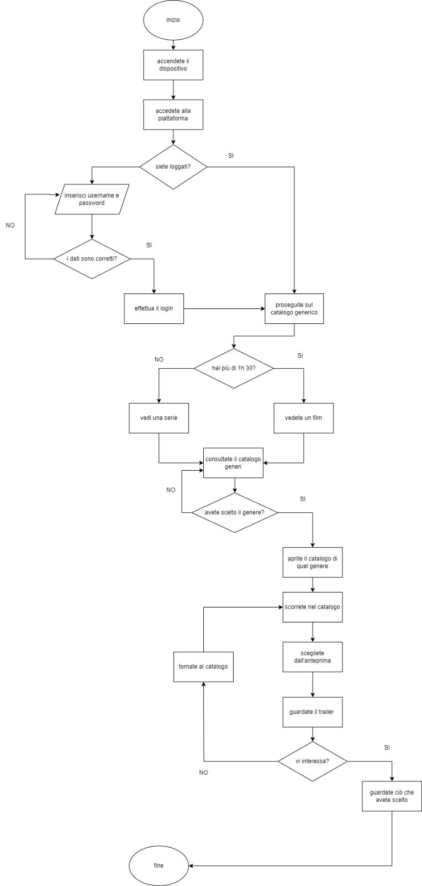

PROBLEMA: SCEGLIERE COSA C'E' DA GUARDADE SU NETFLIX STASERA

1) Inizio
2) Accedere al dispositivo
3) Accedere alla piattaforma di netflix
4) ? SE - Siete loggati?  
    4.1) SI proseguire sul catalogo generico 
    4.2) :ALTRIMENTI - NO inserire username e password

5) ? SE - I dati sono corretti 
    5.1) SI effettua il login 
    5.2) :ALTRIMENTI - NO torna a 4.1 inserire user e pass

6) ? SE - Hai piu' di 1 ora e 30 minuti 
    6.1) SI vedi un film 
    6.2) :ALTRIMENTI - NO vedi una serie

7) Consulta il catalogo dei generi

8) ? SE - Avete scelto il genere 
    8.1) SI aprire il catalogo scelto 
    8.2) :ALTRIMENTI - NO consulta nuovamente il catalogo dei generi

9) Scorrere nel catalogo

10) Scegliere dall'anteprima

11) Guardare il trailer

12) ? SE - Vi interessa 
    12.1) SI Cliccare Play e guardare cio' che avete scelto 
    12.2) :ALTRIMENTI - NO tornare a consultare il catalogo

13) Fine